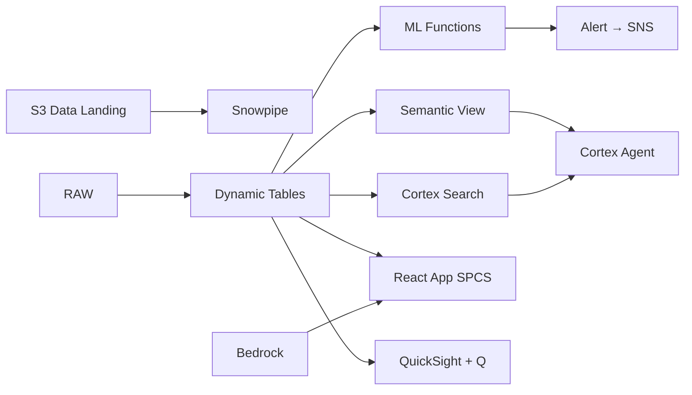

# Shariah Compliance Monitoring

Automated Shariah compliance validation for Malaysia's RM 2.3T Islamic finance sector — AI_PARSE_DOCUMENT extracts contract terms, Cortex Search indexes fatwas, and Cortex Complete validates against BNM guidelines.

## Architecture

Malaysia leads the global Islamic finance market with RM 2.3 trillion in assets governed by Shariah principles. Bank Negara Malaysia requires continuous compliance monitoring, but manual contract review creates weeks of backlog. When BNM updates guidelines, 5,000 active contracts must be re-validated — a process that currently takes the compliance team 6 weeks. Meanwhile, 6 conflicting DSN rulings on commodity murabahah remain unresolved, creating legal uncertainty.



## Snowflake Capabilities

| Capability | Implementation |
|-----------|---------------|
| Dynamic Tables | CONTRACT_COMPLIANCE_STATUS / FATWA_CONFLICT_MATRIX / COMPLIANCE_DASHBOARD / AUDIT_TIMELINE |
| ML Functions | ML.CLASSIFICATION |
| Cortex AI | AI_PARSE_DOCUMENT, AI_EXTRACT, COMPLETE |
| Cortex Search | 200 documents indexed |
| Cortex Agent | SHARIAH_COMPLIANCE_AGENT |
| Semantic View | SHARIAH_COMPLIANCE_ANALYTICS |
| React App (SPCS) | 5 tabs + DemoGuide |


## AWS Services

| Service | Role in Demo |
|---------|-------------|
| Amazon S3 | Store financing contract documents and fatwa PDFs |
| Amazon Textract | OCR and extract text from scanned Arabic/Malay contract documents |
| Amazon Bedrock (Claude) | Generate compliance validation opinions and risk assessments |
| Amazon SNS | Notify Shariah Committee of non-compliance events |
| Amazon QuickSight + Q | Compliance dashboard with natural language queries |


## Personas

| Persona | Role | Key Questions |
|---------|------|---------------|
| **Ustaz Dr. Mohd Nazri** | Shariah Committee Chairman | "Which contracts are flagged as non-compliant?" "Are there conflicting DSN rulings on murabahah structures?" |
| **Nurul Aisyah binti Kamal** | Compliance Officer | "How many contracts are pending Shariah review?" "Show me the latest BNM guideline updates affecting our products." |


## Data

| Table | Rows | Description |
|-------|------|-------------|
| FATWA_LIBRARY | 200 | Indexed fatwa rulings from Shariah Advisory Council and DSN |
| FINANCING_CONTRACTS | 5,000 | Islamic financing contracts (murabahah, ijarah, musharakah, etc.) |
| AUDIT_RECORDS | 1,000 | Shariah audit trail and review records |
| BNM_GUIDELINES | 50 | Bank Negara Malaysia Shariah governance guidelines |
| COMPLIANCE_EVENTS | 8,000 | Compliance validation events and outcomes |


## Build Instructions

### Prerequisites
- Snowflake account with ACCOUNTADMIN access
- Cortex AI enabled (ML Functions, Search, Agent)
- Warehouse: SHARIAH_WH (Medium)
- AWS CLI with access (us-west-2)

### Deployment

```bash
snowsql -f snowflake/00_setup.sql
snowsql -f snowflake/01_marketplace_install.sql
snowsql -f snowflake/02_raw_tables.sql
snowsql -f snowflake/03_staging.sql
snowsql -f snowflake/04_dynamic_tables.sql
snowsql -f snowflake/05_search.sql
snowsql -f snowflake/06_ml_models.sql
snowsql -f snowflake/07_semantic_view.sql
snowsql -f snowflake/08_agent.sql
```

### React App (SPCS)
```bash
cd app && npm ci && npm run build
docker build -t aws-malaysia-islamic-finance-shariah-app .
docker push bdiqc8sm-default.registry.snowflakecomputing.com/islamic_shariah_compliance/app/aws_malaysia_islamic_finance_shariah/app:latest
```

### Demo Mode
Open the app URL with `?demo=true` for presenter view.

## Build Modes

### Snowflake Only
Run scripts 00-08 (skip AWS-specific integration). Uses:
- **Snowflake Internal Stage + Directory Tables** instead of Amazon S3
- **AI_PARSE_DOCUMENT** instead of Amazon Textract
- **Cortex Complete** instead of Amazon Bedrock (Claude)
- **Alerts + Notification Integration** instead of Amazon SNS
- **Snowflake Intelligence (Cortex Analyst)** instead of Amazon QuickSight + Q

### Full AWS + Snowflake
Run all scripts including AWS integration. Deploy QuickSight dashboard from `quicksight/`.

## Business Impact

Industry research and Snowflake customer outcomes:
- **Malaysia's Islamic banking assets reached RM 1.2 trillion, representing 40.3% of total banking system** — [Bank Negara Malaysia](https://www.bnm.gov.my/islamic-banking-takaful)
- **Islamic finance sector contributed 25.6% to Malaysia's overall financial system in 2023** — [MIFC](https://www.mifc.com/)
- **Manual Shariah compliance review takes 4-6 weeks per product — AI reduces to hours** — [Deloitte Islamic Finance](https://www.deloitte.com/my/en/Industries/financial-services.html)
- **Non-compliance penalties from BNM can reach RM 25 million per incident** — [IFSA 2013](https://www.bnm.gov.my/publications)
- **Western Union** (Snowflake customer): processes 1B+ cross-border transactions on Snowflake with real-time compliance monitoring across 200+ countries -- [snowflake.com/customers/western-union](https://www.snowflake.com/en/customers/all-customers/case-study/western-union/)

## Key Demo Numbers

- **RM 2.3T** total Islamic assets under Shariah governance
- **12 contracts** flagged non-compliant this quarter
- **6 DSN rulings** in conflict on commodity murabahah
- **200 fatwas** indexed and searchable via Cortex Search
- **98.4%** overall Shariah compliance rate
- **5,000 contracts** actively monitored for compliance


## License

Apache 2.0 — See [LICENSE](LICENSE) for details.

This is a personal demo project and is not an official Snowflake offering. It comes with no support or warranty.