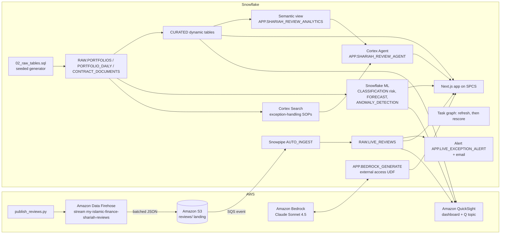

# Malaysia Islamic Bank Shariah Review Operations - Documentation Exceptions and Committee Escalations

End-to-end Shariah review operations for **40 financing portfolios at a fictional Malaysian Islamic bank across 5 cities** (Kuala Lumpur, George Town, Johor Bahru, Kota Kinabalu, Kuching) using Snowflake, optionally with AWS: from a live review exception to a 7-day committee escalation risk score, an alert email and an AI action memo for the Shariah review team.

## Architecture

A Shariah review operations pipeline built on **Snowflake** (Dynamic Tables, Snowflake ML, Cortex Search, Cortex Agent, Cortex AI_COMPLETE, SPCS) and, in the full build, **AWS** (Amazon Data Firehose, S3, Bedrock Claude, QuickSight + Amazon Q). Review result events land in `RAW.LIVE_REVIEWS`. Dynamic tables curate 90 days of portfolio-day history: contracts reviewed, documentation exceptions, escalations to the Shariah committee, rectification SLA breaches, clean review rate and branch process review compliance. Snowflake ML scores the 7-day risk that a portfolio's exceptions are escalated to the committee, forecasts bank-wide exception volume and flags document rejection rate anomalies. A Cortex Agent answers questions with SOP citations, and an LLM drafts the review action memo.

The portfolios cover five common Islamic financing structures: tawarruq (a sequence of commodity purchase and sale transactions) for personal financing, murabahah (a sale at cost plus a disclosed margin) for SMEs, musharakah mutanaqisah (a diminishing partnership) for homes, ijarah (a lease) for vehicles, and wakalah (an agency arrangement) for trade financing. Exceptions are operational documentation checks, such as a missing commodity trade confirmation or a rental schedule mismatch. The demo models review operations only: escalated matters are decided by the bank's Shariah committee, the demo makes no Shariah, religious or regulatory rulings, and its SOPs are synthetic.

Interactive diagrams (hover for object names): [Snowflake only](docs/architecture-snowflake.html) | [AWS + Snowflake](docs/architecture-aws.html). The app shows both on its Architecture & Data tab, the current build first. Regenerate them with `python3 docs/build_architecture.py`.


```mermaid
flowchart LR
    subgraph AWS
      SIM[publish_reviews.py] --> FH[Amazon Data Firehose<br/>stream my-islamic-finance-shariah-reviews]
      FH -->|batched JSON| S3[(Amazon S3<br/>reviews/ landing)]
      BR[Amazon Bedrock<br/>Claude Sonnet 4.5]
      QS[Amazon QuickSight<br/>dashboard + Q topic]
    end
    subgraph Snowflake
      S3 -->|SQS event| PIPE[Snowpipe AUTO_INGEST] --> LIVE[RAW.LIVE_REVIEWS]
      GEN[02_raw_tables.sql<br/>seeded generator] --> RAW[RAW.PORTFOLIOS / PORTFOLIO_DAILY / CONTRACT_DOCUMENTS]
      RAW --> DT[CURATED dynamic tables]
      RAW --> ML[Snowflake ML<br/>CLASSIFICATION risk, FORECAST,<br/>ANOMALY_DETECTION]
      DT --> SV[Semantic view<br/>APP.SHARIAH_REVIEW_ANALYTICS]
      RAW --> CS[Cortex Search<br/>exception-handling SOPs]
      SV --> AG[Cortex Agent<br/>APP.SHARIAH_REVIEW_AGENT]
      CS --> AG
      LIVE --> AL[Alert APP.LIVE_EXCEPTION_ALERT<br/>+ email]
      UDF[APP.BEDROCK_GENERATE<br/>external access UDF]
      TK[Task graph: refresh, then rescore]
      APP[Next.js app on SPCS]
    end
    BR <--> UDF
    DT --> APP
    ML --> APP
    LIVE --> APP
    AG --> APP
    UDF --> APP
    DT --> QS
    ML --> QS
    LIVE --> QS
```

The Snowflake-only build drops the AWS subgraph: `APP.SIMULATE_REVIEWS` writes to `RAW.LIVE_REVIEWS`, and the app calls Cortex `AI_COMPLETE` instead of the Bedrock UDF.

## Snowflake Capabilities

| Capability | Implementation |
|-----------|---------------|
| Dynamic Tables | `CURATED.KPI_SUMMARY`, `PERFORMANCE_SUMMARY`, `EXCEPTION_SUMMARY`, `TREND_ANALYSIS` from the RAW tables |
| Snowflake ML | CLASSIFICATION 7-day committee escalation risk (`ML.ESCALATION_RISK_SCORES`), 14-day exception-volume FORECAST, document rejection rate ANOMALY_DETECTION |
| Cortex Search | 13 synthetic exception-handling SOPs (one per financing product and exception reason) in `SEARCH.REVIEW_SOP_SEARCH` |
| Semantic View | `APP.SHARIAH_REVIEW_ANALYTICS` over portfolios, exception reasons, daily totals and risk |
| Cortex Agent | `APP.SHARIAH_REVIEW_AGENT`: Cortex Analyst over the semantic view plus Cortex Search for SOP citations |
| Cortex AI | `AI_COMPLETE('claude-sonnet-4-5')` for grounded answers, and for the action memo in the Snowflake-only build |
| Alerts + Tasks | `APP.LIVE_EXCEPTION_ALERT` logs EXCEPTION review results and sends email; task graph `TASK_REFRESH_CURATED`, then `TASK_RESCORE_RISK` |
| Snowpark Container Services | Next.js app `APP.MY_ISLAMIC_FINANCE_SHARIAH_APP` with 6 tabs: Executive Cockpit, Predictive, Controls, Live Reviews, Ask AI, Architecture & Data |
| Snowpipe | `RAW.LIVE_REVIEWS_PIPE` AUTO_INGEST from S3 (AWS build only) |

## AWS Services

Used only in the AWS + Snowflake build.

| Service | Role in Demo |
|---------|-------------|
| Amazon Data Firehose | Direct PUT stream `my-islamic-finance-shariah-reviews` receives simulated review result events and writes batches to S3 |
| Amazon S3 | Landing bucket (`reviews/`). An event notification goes to the Snowpipe SQS queue |
| Amazon Bedrock | Claude Sonnet 4.5 writes the action memo, called from Snowflake through an external-access UDF |
| Amazon QuickSight | DIRECT_QUERY executive dashboard over Snowflake (daily documentation exceptions, escalations by portfolio, escalation risk) |
| Amazon Q | Natural-language questions over the QuickSight topic `my-islamic-finance-shariah-topic` |
| AWS IAM | Least-privilege roles for S3, Firehose and Bedrock |

## Personas

These personas are fictional.

| Persona | Role | Key Questions |
|---------|------|---------------|
| **Siti Hajar Ahmad** | Head of Shariah Review | "What is our clean review rate?" "Which exception reasons end up with the Shariah committee?" |
| **Farid Iskandar** | Shariah Review Analyst | "Which portfolios are high risk this week, and which SOP applies?" |

## Data

All data is synthetic and seeded, so every rebuild reproduces it. The bank, portfolios and names are fictional; the cities are real Malaysian cities used as regions.

| Table | Rows | Description |
|-------|------|-------------|
| RAW.PORTFOLIOS | 40 | Financing portfolios across 5 cities and 5 products (Personal financing-i tawarruq, SME financing-i murabahah, Home financing-i musharakah mutanaqisah, Vehicle financing-i ijarah, Trade financing-i wakalah), with a process complexity grade |
| RAW.PORTFOLIO_DAILY | 3,600 | Daily portfolio observations over 90 days: contracts reviewed, value (MYR), documentation exceptions, escalations, rectification SLA breaches, exception reason, branch process reviews, document rejection rate and average review turnaround hours |
| RAW.CONTRACT_DOCUMENTS | 40 | Required, on-file and pending contract file documents per portfolio |
| SEARCH.REVIEW_DOCS | 13 | Synthetic exception-handling SOPs indexed for Cortex Search |
| RAW.LIVE_REVIEWS | Grows during the demo | Live review result events from Firehose (AWS build) or `APP.SIMULATE_REVIEWS` (Snowflake-only build) |
| ML.ESCALATION_RISK_SCORES | 40 | 7-day escalation probability and risk band per portfolio |

## Build Instructions

### Prerequisites
- Snowflake account with ACCOUNTADMIN access, and Cortex AI enabled (AI_COMPLETE, Search, Agent).
- An X-Small warehouse with auto-suspend at or below 120 s, and an existing SPCS compute pool.
- Python 3.11+, `snowflake-connector-python`, Node.js 22+, Docker and the `snow` CLI.
- App image: run `snow spcs image-registry login`, then build and push `my-islamic-finance-shariah-app:v1` to the database's `APP.IMAGES` repository (see the header of `snowflake/07_deploy_app.sql`).
- AWS build only: `boto3`, AWS credentials for the target account (us-west-2) with Bedrock access, and QuickSight Enterprise.

### SPCS App
```
<DATABASE>.APP.MY_ISLAMIC_FINANCE_SHARIAH_APP
```

### Tests
```bash
python -m pytest aws snowflake quicksight
```

For a local run, put `SNOWFLAKE_ACCOUNT`, `SNOWFLAKE_USER`, `SNOWFLAKE_DATABASE`, `SNOWFLAKE_WAREHOUSE`, `SNOWFLAKE_AUTHENTICATOR=PROGRAMMATIC_ACCESS_TOKEN`, `SNOWFLAKE_TOKEN` and `DEMO_PLATFORM` in the environment, then run `npm --prefix app run build && npm --prefix app start`.

## Build Modes

Both modes share the same core. They differ in three places, and the app's `DEMO_PLATFORM` setting (in its SPCS spec) switches the memo provider and the Live Reviews tab.

| Layer | Snowflake Only | Full AWS + Snowflake |
|---|---|---|
| Live review results | `CALL APP.SIMULATE_REVIEWS(n)` inserts simulated review result events into `RAW.LIVE_REVIEWS`. This simulates a review results feed; it is not Snowpipe Streaming | `aws/publish_reviews.py` to Amazon Data Firehose, then S3, SQS and Snowpipe AUTO_INGEST |
| Action memo | Cortex `AI_COMPLETE('claude-sonnet-4-5')` | Amazon Bedrock Claude Sonnet 4.5 through `APP.BEDROCK_GENERATE` |
| BI and natural-language questions | The SPCS app is the dashboard; questions go to the Cortex Agent | Also a QuickSight dashboard and an Amazon Q topic |
| App setting | `DEMO_PLATFORM: snowflake` | `DEMO_PLATFORM: aws` |

### Snowflake Only

```bash
# 1. Core data and dynamic tables (guarded: new isolated database only)
python snowflake/run_core.py --database MALAYSIA_ISLAMIC_FINANCE_SHARIAH_SNOWFLAKE --warehouse <XS_WAREHOUSE> --connection <CONNECTION> --apply
# 2. Native review feed, ML, search, semantic view, agent, alert and task graph
python snowflake/run_intelligence.py --database MALAYSIA_ISLAMIC_FINANCE_SHARIAH_SNOWFLAKE --platform snowflake --warehouse <XS_WAREHOUSE> --connection <CONNECTION> --alert-email you@example.com
# 3. App on SPCS with DEMO_PLATFORM=snowflake (push the image first)
python snowflake/run_intelligence.py --database MALAYSIA_ISLAMIC_FINANCE_SHARIAH_SNOWFLAKE --platform snowflake --warehouse <XS_WAREHOUSE> --connection <CONNECTION> --alert-email you@example.com --files 07_deploy_app.sql --compute-pool <COMPUTE_POOL>
```

During the demo:
- Run `CALL APP.SIMULATE_REVIEWS(20)` to add live review result events. For a continuous feed, run `ALTER TASK APP.TASK_SIMULATE_REVIEWS RESUME`, and `SUSPEND` it afterwards.
- Run `EXECUTE ALERT APP.LIVE_EXCEPTION_ALERT` to raise the alert email.
- Run `EXECUTE TASK APP.TASK_REFRESH_CURATED` to refresh the curated tables and rescore committee escalation risk.

Afterwards, drop the database or run `ALTER SERVICE APP.MY_ISLAMIC_FINANCE_SHARIAH_APP SUSPEND`.

### Full AWS + Snowflake

```bash
# 1. Core data and dynamic tables (guarded: new isolated database only)
python snowflake/run_core.py --database MALAYSIA_ISLAMIC_FINANCE_SHARIAH_AWS --warehouse <XS_WAREHOUSE> --connection <CONNECTION> --apply
# 2. AWS ingestion and Bedrock (dry run first, then --apply)
python aws/setup_aws.py --database MALAYSIA_ISLAMIC_FINANCE_SHARIAH_AWS --account <AWS_ACCOUNT_ID> --connection <CONNECTION> --apply
# 3. ML, search, semantic view, agent, alert and task graph
python snowflake/run_intelligence.py --database MALAYSIA_ISLAMIC_FINANCE_SHARIAH_AWS --platform aws --warehouse <XS_WAREHOUSE> --connection <CONNECTION> --alert-email you@example.com
# 4. App on SPCS with DEMO_PLATFORM=aws (push the image first)
python snowflake/run_intelligence.py --database MALAYSIA_ISLAMIC_FINANCE_SHARIAH_AWS --platform aws --warehouse <XS_WAREHOUSE> --connection <CONNECTION> --alert-email you@example.com --files 07_deploy_app.sql --compute-pool <COMPUTE_POOL>
# 5. QuickSight dashboard and Q topic (needs an existing Snowflake data source)
python quicksight/build_dashboards.py --database MALAYSIA_ISLAMIC_FINANCE_SHARIAH_AWS --account <AWS_ACCOUNT_ID> --principal-arn <QUICKSIGHT_USER_ARN> --data-source-arn <DATA_SOURCE_ARN> --prefix my-islamic-finance-shariah --apply --update --with-topic
```

QuickSight objects must be shared with the QuickSight user who signs in (`--principal-arn`); otherwise the console shows nothing.

During the demo:
- Run `python aws/publish_reviews.py --count 20` to send live review result events. Firehose buffers for up to 60 seconds before writing to S3.
- Run `EXECUTE ALERT APP.LIVE_EXCEPTION_ALERT` to raise the alert email.
- Run `EXECUTE TASK APP.TASK_REFRESH_CURATED` to refresh the curated tables and rescore committee escalation risk.

Afterwards, `python aws/teardown_aws.py --database MALAYSIA_ISLAMIC_FINANCE_SHARIAH_AWS --account <AWS_ACCOUNT_ID> --connection <CONNECTION> --apply` removes the AWS resources and the account-level Bedrock external-access and S3 storage integrations. It leaves the email integration `MY_ISLAMIC_FINANCE_SHARIAH_EMAIL_INT`, which the Snowflake-only build also uses.

## Business Impact

Snowflake customer outcomes in financial services:
- **Western Union** (Snowflake customer): "Western Union Reduces Costs 50% And Achieves Multi-Cloud Strategy With Snowflake" -- [Snowflake customer story: Western Union](https://www.snowflake.com/en/customers/all-customers/case-study/western-union/)
- **Saxo Bank** (Snowflake customer): "Banking on Big Data: Snowflake Enables Saxo Bank to Grow in Size and Agility" -- [Snowflake customer story: Saxo Bank](https://www.snowflake.com/en/customers/all-customers/case-study/saxo-bank/)

## Key Demo Numbers

These figures are synthetic and come from the seeded demo data. Forecast and anomaly figures can shift slightly with the build day.

- **40 portfolios** across 5 Malaysian cities and 5 financing products, 3,600 portfolio-days over 90 days; **743,308 contracts reviewed** worth MYR 80,328 M
- **Clean review rate 99.93%**: **531 documentation exceptions**, of which **138** were escalated to the Shariah committee (escalation rate 26.0%); **65 rectification SLA breaches**
- **Execution sequence not evidenced** and **customer acknowledgement missing** produce the most escalations (39 and 37, from 102 and 143 exceptions); the 16 document system outage exceptions are always rectified without escalation
- **Escalation risk model** out-of-time holdout: precision 0.29, recall 0.19 at a 0.5 threshold, against a 0.20 base rate. One portfolio is high risk: PRT-0000, at 84.3%
- **14-day exception forecast** with prediction intervals; **36 of 640** portfolio-days flagged as document rejection rate anomalies
- **Process review compliance 82.8%**, contract file coverage 61.1%, with 13 documents pending
- **13 SOPs** indexed for Cortex Search and cited by ID in agent answers

## License

Apache 2.0 — See [LICENSE](LICENSE) for details.

This is a personal demo project and is not an official Snowflake offering. It comes with no support or warranty. Snowflake customer outcomes cited are from Snowflake customer stories; they represent reported outcomes and are not guarantees of results. The demo does not provide Shariah, legal or regulatory advice and makes no Shariah rulings.
